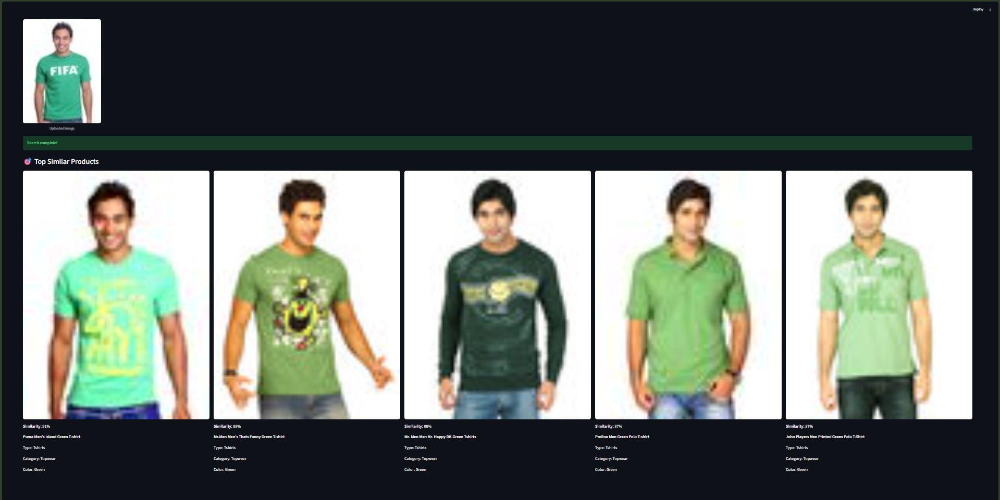
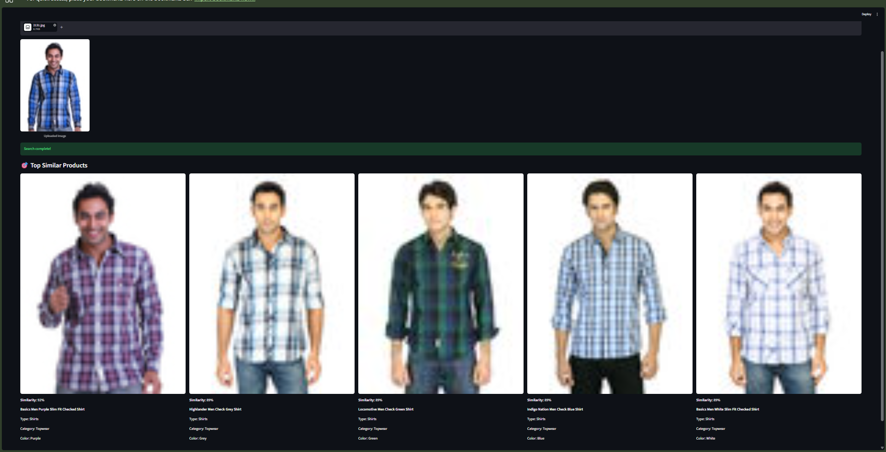
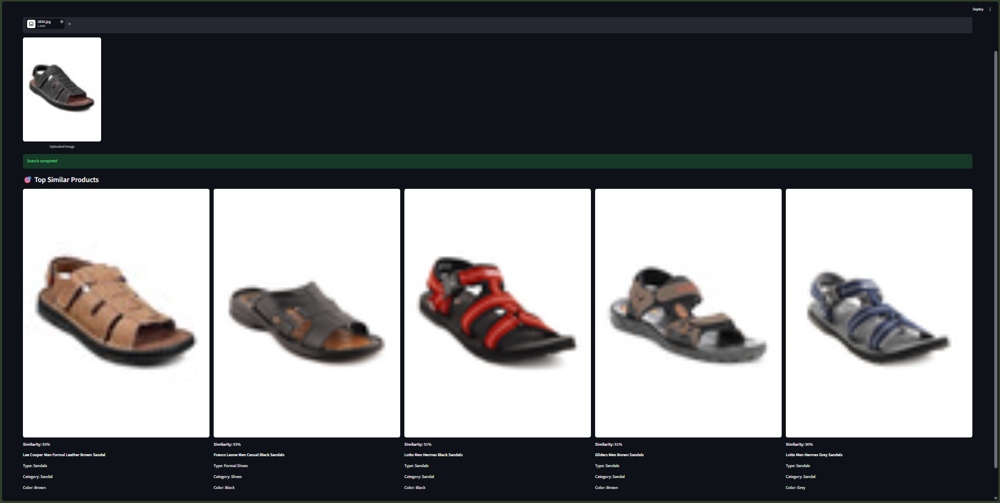
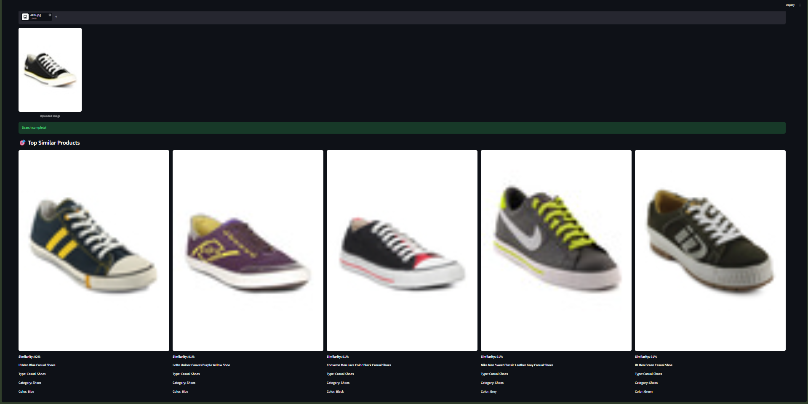

# Nearly

AI-powered Visual Product Search using Deep Learning and Vector Similarity Search.


## Overview

Nearly is a computer vision application that allows users to upload a fashion product image and retrieve visually similar products from a catalog.

The system combines deep learning-based image embeddings with FAISS vector search to identify products that share similar visual characteristics such as category, style, color, and overall appearance.

This project was built to explore modern image retrieval systems similar to Pinterest Lens, Amazon StyleSnap, and ASOS Style Match.

---

## Problem Statement

Traditional product search relies heavily on text queries.

However, users often find products through images rather than text descriptions.

The challenge is to build a system that can understand the visual characteristics of a fashion product and retrieve similar products without relying on manual keyword matching.

---

## Solution

Nearly uses a fine-tuned EfficientNet-B0 model to generate fashion-aware image embeddings.

The generated embeddings are indexed using FAISS, enabling efficient nearest-neighbor search in vector space.

Workflow:

1. User uploads a fashion image
2. Image is transformed and passed through EfficientNet-B0
3. A 1280-dimensional embedding is generated
4. FAISS performs similarity search
5. Top matching products are retrieved and displayed

---

## Architecture


---

## Project Workflow

```text
User Uploads Image
        │
        ▼
     Streamlit
        │
        ▼
 EfficientNet-B0
 Feature Extractor
        │
        ▼
 1280-D Embedding
        │
        ▼
   FAISS Search
        │
        ▼
 Similar Products
```

---

## Tech Stack

### Deep Learning

* PyTorch
* EfficientNet-B0
* Transfer Learning

### Similarity Search

* FAISS

### Application Layer

* Streamlit

### Data Processing

* Pandas
* NumPy
* Pillow

---

## Model Development

### Phase 1

Pretrained EfficientNet-B0 was used as a feature extractor to generate embeddings.

While retrieval quality was reasonable, the model often focused on generic visual patterns rather than fashion-specific characteristics.

### Phase 2

EfficientNet-B0 was fine-tuned on a fashion dataset containing 13 product categories:

* Topwear
* Bottomwear
* Shoes
* Bags
* Watches
* Jewellery
* Eyewear
* Wallets
* Belts
* Sandals
* Socks
* Innerwear
* Flip Flops

Fine-tuning significantly improved category-aware retrieval quality.

### Training Results

| Metric              | Value  |
| ------------------- | ------ |
| Training Accuracy   | 99.20% |
| Validation Accuracy | 96.07% |

---

## Sample Results

### Example 1



### Example 2



### Example 3



---
### Example 4


---
### Example 5



---

## Features

* Upload fashion images
* Generate image embeddings
* Similarity search using FAISS
* Retrieve visually similar products
* Display product metadata
* Real-time search interface

---

## Future Improvements

* Budget-aware recommendations
* Brand-aware search
* Color filtering
* Outfit completion recommendations
* Multi-image search
* Cloud deployment
* User preference learning

---

## Key Learnings

This project provided hands-on experience with:

* Transfer Learning
* Feature Extraction
* Embedding Generation
* Vector Databases
* Similarity Search
* Computer Vision Product Development
* End-to-End ML Application Deployment

---

## Author

Built as part of a Computer Vision portfolio focused on practical deep learning applications.
